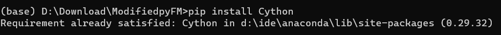
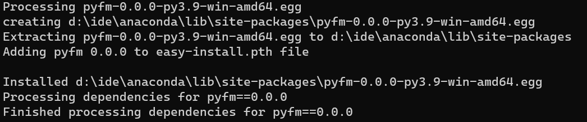
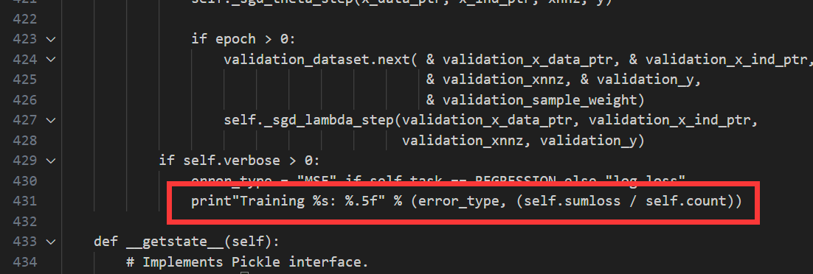
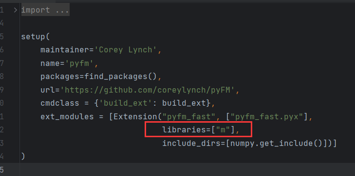
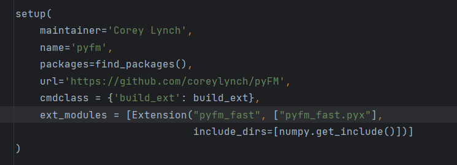
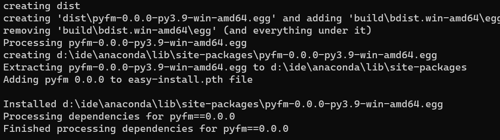

# `pyfm`安装失败解决教程

毛毛张最近在入门推荐系统，刚学习到因子分解机(FM)，它有个已经构建好的Python库，需要我们自己安装，但是毛毛张本以为`pip install pyfm`就可以解决，没想到遇到了好多问题，于是看了网上好多解决教程并结合ChatGPT才解决，并没有像教程说的那么顺利安装成功。

由于这个过程中遇到了好多问题，所以毛毛张今天给大家分享一个pyfm安装失败的解决教程。（毛毛张絮叨几句：天下文章一大抄，但是真正能解决问题的就那么几个教程，因为很难做到符合你所遇到的所处环境下的解决方案，写在前面，毛毛张这里引用其它的教程，也不是为了拉踩，可能别人的环境就能很好的安装成功，毛毛张在这里叙述的是遇到如下问题时的解决方案）

## 1.`pyfm`的简介

 `pyfm` 是一个用于实现因子分解机（`FM`）算法的`Python`库，可以用于处理稀疏数据集。`FM`算法是一种基于因子分解的机器学习算法，可以用于分类和回归任务。与传统的线性模型相比，`FM`算法可以处理更加复杂的特征交互，从而提高模型的预测精度。`pyfm `库提供了一个简单易用的`API`，可以方便地构建和训练FM模型。

该库的源码地址：https://github.com/coreylynch/pyFM

毛毛张修改后的源代码地址：https://github.com/zzx030702/ModifiedpyFM

## 2.安装环境

**操作系统：**Windows11

**Python版本：**Python3.XX

## 3.安装步骤

### 1.手动从毛毛张提供的源代码构建该软件包(推荐)

由于官方提供的`pyFM`库存在很多问题，毛毛张根据自己遇到的问题对源代码中的问题作出了修正，并上传到`github`上面，如果大家没有安装可以根据这个步骤从头开始安装，如果大家在安装途中遇到的问题，可以跳转到[方式3](# 3.手动从官网源代码构建该软件包(官网的源代码有语法问题，不推荐))

1.大家可以直接从`github`上面下载到本地：https://github.com/zzx030702/ModifiedpyFM；

2.首先打开自己的`Anaconda Prompt`，并激活自己的虚拟环境(为了方便，毛毛张直接在base环境下进行演示)；

3.安装`Cython`包：`pip install Cython`；



**4.使用`cd`命令进入到刚刚下载的`pyFM源代码`文件夹下；**


5.一定要先进入源代码文件目录下，然后再执行命令：`python setup.py install`，如下图所示则表明安装成功，大家可以跳转到下面的[测试案例](# 6.官方测试案例)进行测试。



### 2.直接git install命令

不知道是不是毛毛张的电脑里面的设置出了问题，直接使用`git install`命令时出现了问题，如果大家的电脑没有出现问题的话，也可以先尝试这个方案，直接使用下面命令进行安装：

```bash
(base) C:\Users\lenovopc>pip install git+https://github.com/zzx030702/ModifiedpyFM
```

### 3.手动从官网源代码构建该软件包(官网的源代码有语法问题，不推荐)

1.手动下载源代码到本地文件：https://github.com/coreylynch/pyFM；

**2.打开自己的虚拟环境，并使用`cd`命令进入到刚刚下载的`pyFM源代码`文件夹下；**

3.执行命令：`python setup.py`

**报错1：**

```bash
Traceback (most recent call last):
  File "D:\Download\ModifiedpyFM\setup.py", line 2, in <module>
    from Cython.Distutils import build_ext
ModuleNotFoundError: No module named 'Cython'
```

**解决方案：安装`Cython`包**

4.安装`Cython`包：`pip install Cython`，再次执行命令：`python setup.py`

**报错2：**

```bash
D:\IDE\Anaconda\lib\site-packages\Cython\Compiler\Main.py:381: FutureWarning: Cython directive 'language_level' not set, using '3str' for now (Py3). This has changed from earlier releases! File: D:\Download\pyFM\pyfm_fast.pyx
  tree = Parsing.p_module(s, pxd, full_module_name)

Error compiling Cython file:
------------------------------------------------------------
...
                                             & validation_sample_weight)
                    self._sgd_lambda_step(validation_x_data_ptr, validation_x_ind_ptr,
                                          validation_xnnz, validation_y)
            if self.verbose > 0:
                error_type = "MSE" if self.task == REGRESSION else "log loss"
                print "Training %s: %.5f" % (error_type, (self.sumloss / self.count))
                      ^
------------------------------------------------------------
......
Cython.Compiler.Errors.CompileError: pyfm_fast.pyx
```

**解决方案：**修改`pyfm_fast.pyx`文件的431行：`print "Training %s: %.5f" % (error_type, (self.sumloss / self.count))`

改成`print("Training %s: %.5f" % (error_type, (self.sumloss / self.count)))`

**注意：**就是把`print`后面的语句加上括号。

**原始代码：**



**修改后：**


5.修改好后，再次执行命令：`python setup.py`

**报错3：**

```bash
LINK : fatal error LNK1181: 无法打开输入文件“m.lib”
error: command 'D:\\IDE\\VS\\VS_IDE\\VC\\Tools\\MSVC\\14.35.32215\\bin\\HostX86\\x64\\link.exe' failed with exit code 1181
```

解决方案：删掉`setup.py`文件中的：  `libraries=["m"],`；

**注意：**是的，连着逗号也删掉。

**原始代码：**



**修改后：**



7.最后一次执行`python setup.py install`命令，如下图所示则表明安装成功，大家可以跳转到下面的[测试案例](# 6.官方测试案例)进行测试。



## 4.可能遇到的问题：

本教程参考这篇[博客](https://blog.csdn.net/qq_41185868/article/details/130164326)的教程进行安装，发现这个上面给的方案，都存在问题，记录以下问题

#### 方式1：安装失败

首先打开自己的`Anaconda Prompt`，并激活自己的虚拟环境(为了方便，毛毛张直接在base环境下进行演示)，然后输入下面命令：

```bash
(base) C:\Users\lenovopc>pip install pyfm
```

##### **报错：**

```bash
Collecting pyfm
  Using cached pyfm-0.2.4.tar.gz (12 kB)
  Preparing metadata (setup.py) ... error
  error: subprocess-exited-with-error

  × python setup.py egg_info did not run successfully.
  │ exit code: 1
  ╰─> [6 lines of output]
      Traceback (most recent call last):
        File "<string>", line 2, in <module>
        File "<pip-setuptools-caller>", line 34, in <module>
        File "C:\Users\lenovopc\AppData\Local\Temp\pip-install-1y1d3l1w\pyfm_9567a930502744f1a7c86c19af9ce818\setup.py", line 4, in <module>
          long_description = f.read()
      UnicodeDecodeError: 'gbk' codec can't decode byte 0xa3 in position 161: illegal multibyte sequence
      [end of output]

  note: This error originates from a subprocess, and is likely not a problem with pip.
error: metadata-generation-failed

× Encountered error while generating package metadata.
╰─> See above for output.

note: This is an issue with the package mentioned above, not pip.
hint: See above for details.
```

#### 方式2：安装失败

首先打开自己的`Anaconda Prompt`，并激活自己的虚拟环境(为了方便，毛毛张直接在base环境下进行演示)，然后输入下面命令：

```bash
(base) C:\Users\lenovopc>pip install -i https://pypi.tuna.tsinghua.edu.cn/simple pyfm
```

##### **报错：**

```bash
Looking in indexes: https://pypi.tuna.tsinghua.edu.cn/simple
Collecting pyfm
  Using cached https://pypi.tuna.tsinghua.edu.cn/packages/42/0d/c09ac0297c0604f79e22c28cbcfc7561b492eebe236e98e10cc811882a0f/pyfm-0.2.4.tar.gz (12 kB)
  Preparing metadata (setup.py) ... error
  error: subprocess-exited-with-error

  × python setup.py egg_info did not run successfully.
  │ exit code: 1
  ╰─> [6 lines of output]
      Traceback (most recent call last):
        File "<string>", line 2, in <module>
        File "<pip-setuptools-caller>", line 34, in <module>
        File "C:\Users\lenovopc\AppData\Local\Temp\pip-install-8kmojq7n\pyfm_87098f63c1f9423ea8554a6178353649\setup.py", line 4, in <module>
          long_description = f.read()
      UnicodeDecodeError: 'gbk' codec can't decode byte 0xa3 in position 161: illegal multibyte sequence
      [end of output]

  note: This error originates from a subprocess, and is likely not a problem with pip.
error: metadata-generation-failed

× Encountered error while generating package metadata.
╰─> See above for output.

note: This is an issue with the package mentioned above, not pip.
hint: See above for details.
```

#### 方式3：安装失败

首先打开自己的`Anaconda Prompt`，并激活自己的虚拟环境(为了方便，毛毛张直接在base环境下进行演示)，然后输入下面命令：

```bash
(base) C:\Users\lenovopc>pip install git+https://github.com/coreylynch/pyFM
```

##### **报错：**

```bash
Collecting git+https://github.com/coreylynch/pyFM
  Cloning https://github.com/coreylynch/pyFM to c:\users\lenovopc\appdata\local\temp\pip-req-build-16b7up1j
  Running command git clone --filter=blob:none --quiet https://github.com/coreylynch/pyFM 'C:\Users\lenovopc\AppData\Local\Temp\pip-req-build-16b7up1j'
  fatal: unable to access 'https://github.com/coreylynch/pyFM/': Failed to connect to github.com port 443 after 22128 ms: Couldn't connect to server
  error: subprocess-exited-with-error

  × git clone --filter=blob:none --quiet https://github.com/coreylynch/pyFM 'C:\Users\lenovopc\AppData\Local\Temp\pip-req-build-16b7up1j' did not run successfully.
  │ exit code: 128
  ╰─> See above for output.

  note: This error originates from a subprocess, and is likely not a problem with pip.
error: subprocess-exited-with-error

× git clone --filter=blob:none --quiet https://github.com/coreylynch/pyFM 'C:\Users\lenovopc\AppData\Local\Temp\pip-req-build-16b7up1j' did not run successfully.
│ exit code: 128
╰─> See above for output.

note: This error originates from a subprocess, and is likely not a problem with pip.
```

## 5.依赖

- numpy
- sklearn

## 6.官方测试案例

### Training Representation

The easiest way to use this class is to represent your training data as lists of standard Python dict objects, where the dict elements map each instance's categorical and real valued variables to its values. Then use a [sklearn DictVectorizer](http://scikit-learn.org/dev/modules/generated/sklearn.feature_extraction.DictVectorizer.html#sklearn.feature_extraction.DictVectorizer) to convert them to a design matrix with a one-of-K or “one-hot” coding.

Here's a toy example

```python
from pyfm import pylibfm
from sklearn.feature_extraction import DictVectorizer
import numpy as np
train = [
	{"user": "1", "item": "5", "age": 19},
	{"user": "2", "item": "43", "age": 33},
	{"user": "3", "item": "20", "age": 55},
	{"user": "4", "item": "10", "age": 20},
]
v = DictVectorizer()
X = v.fit_transform(train)
print(X.toarray())
[[ 19.   0.   0.   0.   1.   1.   0.   0.   0.]
 [ 33.   0.   0.   1.   0.   0.   1.   0.   0.]
 [ 55.   0.   1.   0.   0.   0.   0.   1.   0.]
 [ 20.   1.   0.   0.   0.   0.   0.   0.   1.]]
y = np.repeat(1.0,X.shape[0])
fm = pylibfm.FM()
fm.fit(X,y)
fm.predict(v.transform({"user": "1", "item": "10", "age": 24}))
```

### Getting Started

Here's an example on some real  movie ratings data.

First get the smallest movielens ratings dataset from http://www.grouplens.org/system/files/ml-100k.zip.
ml-100k contains the files u.item (list of movie ids and titles) and u.data (list of user_id, movie_id, rating, timestamp).

```python
import numpy as np
from sklearn.feature_extraction import DictVectorizer
from pyfm import pylibfm

# Read in data
def loadData(filename,path="ml-100k/"):
    data = []
    y = []
    users=set()
    items=set()
    with open(path+filename) as f:
        for line in f:
            (user,movieid,rating,ts)=line.split('\t')
            data.append({ "user_id": str(user), "movie_id": str(movieid)})
            y.append(float(rating))
            users.add(user)
            items.add(movieid)

    return (data, np.array(y), users, items)

(train_data, y_train, train_users, train_items) = loadData("ua.base")
(test_data, y_test, test_users, test_items) = loadData("ua.test")
v = DictVectorizer()
X_train = v.fit_transform(train_data)
X_test = v.transform(test_data)

# Build and train a Factorization Machine
fm = pylibfm.FM(num_factors=10, num_iter=100, verbose=True, task="regression", initial_learning_rate=0.001, learning_rate_schedule="optimal")

fm.fit(X_train,y_train)
Creating validation dataset of 0.01 of training for adaptive regularization
-- Epoch 1
Training MSE: 0.59477
-- Epoch 2
Training MSE: 0.51841
-- Epoch 3
Training MSE: 0.49125
-- Epoch 4
Training MSE: 0.47589
-- Epoch 5
Training MSE: 0.46571
-- Epoch 6
Training MSE: 0.45852
-- Epoch 7
Training MSE: 0.45322
-- Epoch 8
Training MSE: 0.44908
-- Epoch 9
Training MSE: 0.44557
-- Epoch 10
Training MSE: 0.44278
...
-- Epoch 98
Training MSE: 0.41863
-- Epoch 99
Training MSE: 0.41865
-- Epoch 100
Training MSE: 0.41874

# Evaluate
preds = fm.predict(X_test)
from sklearn.metrics import mean_squared_error
print("FM MSE: %.4f" % mean_squared_error(y_test,preds))
FM MSE: 0.9227

```

### Classification example

```python
import numpy as np
from sklearn.feature_extraction import DictVectorizer
from sklearn.cross_validation import train_test_split
from pyfm import pylibfm

from sklearn.datasets import make_classification

X, y = make_classification(n_samples=1000,n_features=100, n_clusters_per_class=1)
data = [ {v: k for k, v in dict(zip(i, range(len(i)))).items()}  for i in X]

X_train, X_test, y_train, y_test = train_test_split(data, y, test_size=0.1, random_state=42)

v = DictVectorizer()
X_train = v.fit_transform(X_train)
X_test = v.transform(X_test)

fm = pylibfm.FM(num_factors=50, num_iter=10, verbose=True, task="classification", initial_learning_rate=0.0001, learning_rate_schedule="optimal")

fm.fit(X_train,y_train)

Creating validation dataset of 0.01 of training for adaptive regularization
-- Epoch 1
Training log loss: 1.91885
-- Epoch 2
Training log loss: 1.62022
-- Epoch 3
Training log loss: 1.36736
-- Epoch 4
Training log loss: 1.15562
-- Epoch 5
Training log loss: 0.97961
-- Epoch 6
Training log loss: 0.83356
-- Epoch 7
Training log loss: 0.71208
-- Epoch 8
Training log loss: 0.61108
-- Epoch 9
Training log loss: 0.52705
-- Epoch 10
Training log loss: 0.45685

# Evaluate
from sklearn.metrics import log_loss
print "Validation log loss: %.4f" % log_loss(y_test,fm.predict(X_test))
Validation log loss: 1.5025

```

## 7.参考文献

- https://github.com/coreylynch/pyFM
- https://blog.csdn.net/qq_41185868/article/details/130164326
- https://blog.csdn.net/qq_39797630/article/details/99726706